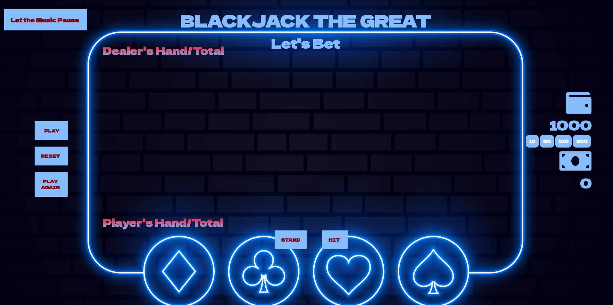

# BLACKJACK 

Welcome to BlackJack The Great

Blackjack, a.k.a twenty-one is a Card game whose object is to be dealt cards having a higher count than those of the dealer, up to but not exceeding 21.The dealer may use a single deck of 52 cards or two or more decks from a holder called a shoe. In this game, it was set up with a single deck of 52 cards.

Please enjoy the game while you play

# SCREENSHOTS

# TECHNOLOGIES USED

- HTML
- CSS
- JavaScript

# HOW TO PLAY THE GAME

## GAME RULES

<a href="https://terbiyelierol.github.io/BLACKJACK-FLEX-P1/">Play The Game</a>

<ol>
<li>Player and Dealer start with the cards in the opening of the game. The Dealer cards should stay on the table one open and the other close. The Player both cards should stay open on the table.</li>
<li>The Player goal should be to accumulate the cards total 21</li>
<li>If Player accumulates the total over 21. Player loses the game </li>
<li>The Dealer goal is to beat the player, while following the same rule of total 21 </li>
<li>Face cards' (e.g. K,Q,J) value is 10 </li>
<li>ACE card (e.g. A) value is either 1 or 11 depends on the player or dealer hands </li>
<li>Face cards' (e.g. K,Q,J) value is 10 </li>
<li>The Player has two options after the cards were distributed. Player could be appreciate with the total of the cards and "STAND" or The Player could require to get more cards to reach 21 or close to 21 this means "HIT" </li>
<li>After Player's decision, dealer starts the game and starts open the cards until dealer beats the player</li>
<li>If the Dealer's first two cards' total is 16 or less, dealer has to get a new card.If the Dealer's first two cards' total is greater than 16, dealer has to stay. </li>
</ol>

# FUTURE OF THE PROJECT

- to play the game with the different screen sizes
- to add new features before starts the game
- to create a board to compare the scores

# RESOURCES

<ul>
<li>Background Music supported by <a href="https://en.wikipedia.org/wiki/The_Cinematic_Orchestra">The Cinematic Orchestra</a></li>
<li>Audio Effects:<a href="https://www.zapsplat.com/"> ZapSlat</a></li>
<li>Background Image:<a href="https://www.freepik.com/"> FreePik</a></li>
</ul>